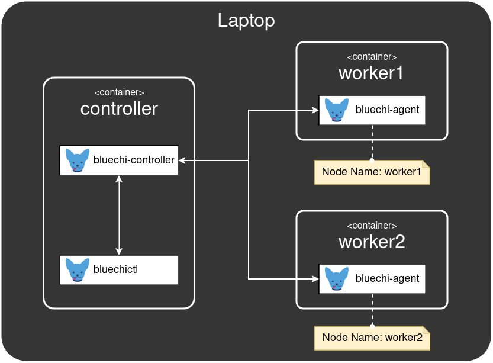

# BlueChi workshop - SETUP

In this section we will setup a system with BlueChi. For the sake of simplicity, we will use containers as an abstract of remote machines running BlueChi. 

__Requirements:__
- podman installed (systemd in a container might be difficult: https://developers.redhat.com/blog/2019/04/24/how-to-run-systemd-in-a-container#)
- root access or sudoer user. Podman can run root-less, but in this demo we prefer to run as root for the sake of convenience

## Target BlueChi system

The diagram below visualizes the target system with BlueChi being set up in the following sections.



## Setup containers and bluechi

### Building or pulling container image

```bash
# Either pull
sudo podman pull quay.io/bluechi/bluechi-workshop
# or build your own
sudo podman build -t localhost/bluechi-workshop -f container/Containerfile ./container
```

or, if there are Internet connection issues, ask the workshop organizer for a flash drive, mount it, and load the image from there

```bash
cd /mnt/drive # Directory where the flash drive was mounted
sudo podman load -i bluechi-workshop.tar
```

### Starting containers

Create a directory to be used as a shared volume for the containers:

```bash
mkdir /tmp/bluechi-workshop
```

Start the containers:

```bash
sudo podman run -dt --rm --name controller --privileged --network host --dns 8.8.8.8 -v /tmp/bluechi-workshop:/share bluechi-workshop:latest
sudo podman run -dt --rm --name worker1 --privileged --network host --dns 8.8.8.8 -v /tmp/bluechi-workshop:/share bluechi-workshop:latest
sudo podman run -dt --rm --name worker2 --privileged --network host --dns 8.8.8.8 -v /tmp/bluechi-workshop:/share bluechi-workshop:latest
```

Check all containers are up and running:

```bash
sudo podman container ls
```

### Setup bluechi-controller

```bash
sudo podman exec -it controller /bin/bash
vi /etc/bluechi/controller.conf.d/workshop.conf
```

Insert:
```ini
[bluechi-controller]
# The port the manager listens on to establish connections with the bluechi-agents.
ControllerPort=2020
# Comma separated list of unique bluechi-agent names which can connect to the controller.
AllowedNodeNames=worker1,worker2
# The level used for logging. Supported values are: DEBUG, INFO, WARN and ERROR.
LogLevel=DEBUG
```

Lets start it:
```bash
# check that the controller service is inactive
systemctl status bluechi-controller

# start the controller service
systemctl start bluechi-controller

# check that the controller service is active
systemctl status bluechi-controller
```

Exit the controller container:
```bash
exit
```

### Setup bluechi-agents

For each worker do:

```bash
sudo podman exec -it worker<no> /bin/bash
vi /etc/bluechi/agent.conf.d/workshop.conf
```

Insert, replacing `<no>` with the worker number:
```ini
[bluechi-agent]
# The unique name of this agent.
NodeName=worker<no>
# The IP address the bluechi-controller listens on.
ControllerHost=127.0.0.1
# The port bluechi-controller listens on.
ControllerPort=2020
# The level used for logging. Supported values are: DEBUG, INFO, WARN and ERROR.
LogLevel=DEBUG
```

Lets start it:
```bash
# check that the agent service is inactive
systemctl status bluechi-agent

# start the agent service
systemctl start bluechi-agent

# check that the agent service is active
systemctl status bluechi-agent
```

Exit the worker container:
```bash
exit
```

---

[Next](2.BASIC_OPERATIONS.md)
