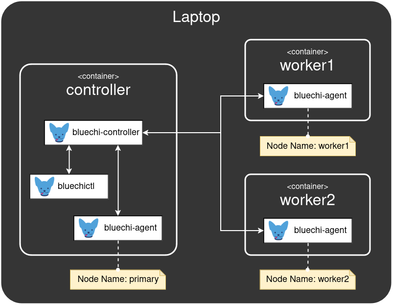

# BlueChi workshop - Basic Operations

In this section we use the setup from [the previous chapter](./1.SETUP.md) and get acquainted with `bluechictl` to control and monitor the system.

## First steps

First, lets connect to the container running the `bluechi-controller` and check out the commands `bluechictl` provides:

```bash
sudo podman exec -it controller /bin/bash

bluechictl version
bluechictl --help
```

We will explore some of the `bluechictl` commands in the following sections.

## Checking and monitoring status of BlueChi nodes

In the controller container, we can use `bluechictl` to get the status of all `bluechi-agent`s (also called nodes) connected to the `bluechi-controller`:

```bash
# Check the status of all nodes
bluechictl status
# Or the status of a specific node
bluechictl status worker1
```

By adding the `-w` flag, we can continuously monitor the status of nodes:

```bash
# Check the status of all nodes
bluechictl status -w
# Or the status of a specific node
bluechictl status worker1 -w
```

Lets try this out by stopping one of the agents!

Keep monitoring the status of all nodes on the controller container via `bluechictl`:

```bash
bluechictl status -w
```

Then open a new terminal and connect to the worker1 container:

```bash
sudo podman exec -it worker1 /bin/bash

# stop the agent on worker1 to trigger a disconnect
systemctl stop bluechi-agent.service
```

In the terminal monitoring the bluechi-agents, the state of `worker1` changed to `offline`, and the `LAST SEEN` field was updated with a timestamp.

Lets start the agent service on the `worker1` container again:

```bash
systemctl start bluechi-agent.service
```

The state of `worker1` in the monitoring terminal should be back to `online`.


## Adding a new BlueChi node

At the moment, `bluechi-agent` is running in the `worker1` and `worker2` container. It is, however, possible to run agent and controller alongside on the same machine. The diagram below visualizes the new system setup:



Lets set this up!

First, connect to the controller container:

```bash
sudo podman exec -it controller /bin/bash
```

In order to enable a new agent to connect to the container, we need to update the `bluechi-controller` configuration by adding the new node name to the list of allowed nodes. Open the configuration file

```bash
vi /etc/bluechi/controller.conf.d/workshop.conf
```

edit it

```ini
# old
AllowedNodeNames=worker1,worker2

# new
AllowedNodeNames=worker1,worker2,primary
```

and save your changes. Then, restart the `bluechi-controller` so it knows abut the changes:

```bash
systemctl restart bluechi-controller
```

When checking the status via

```bash
bluechictl status
```

the two worker nodes should be online again, but the newly added primary node should be `offline` with the LAST SEEN timestamp `never`. That is because it never connected to the controller. Before starting the `bluechi-agent` service we need to update its configuration:

```bash
vi /etc/bluechi/agent.conf.d/workshop.conf
```

And insert:

```ini
[bluechi-agent]
# The unique name of this agent.
NodeName=primary
# The IP address the bluechi-controller listens on.
ControllerHost=127.0.0.1
# The port bluechi-controller listens on.
ControllerPort=2020
# The level used for logging. Supported values are: DEBUG, INFO, WARN and ERROR.
LogLevel=DEBUG
```

Then start the `bluechi-agent` in the controller container:

```bash
systemctl start bluechi-agent

# optional: check that the agent service is active
systemctl status bluechi-agent
```

When checking the node status now, the `primary` node should be online:

```bash
bluechictl status
```


## Listing services on BlueChi nodes

`bluechictl` provides the `list-units` command which enables viewing all services currently loaded by systemd:

```bash
# get all loaded units for all connected nodes
bluechictl list-units

# get all loaded units for a specific node
bluechictl list-units primary

# a filter can be applied as well, supports globbing
# here: show only bluechi services
bluechictl list-units primary --filter=bluechi\*
```

## Controlling service lifecycle on BlueChi nodes

The container images come preinstalled with a systemd service running an Apache HTTP Server. Let's start it on `worker1`

```bash
bluechictl start worker1 httpd.service

# optional: check that the httpd service is active
bluechictl status worker1 httpd.service
```

Since all the containers are configured with the host network, you can use your webbrowser on your host machine and navigate to http://127.0.0.1:8088/ to make sure that `httpd` is running.

Important: BlueChi controls the services, but is not needed for them to run! You can take down all the BlueChi services, and the Apache Server will continue working:

```bash
sudo podman exec -it worker2 systemctl stop bluechi-agent.service
sudo podman exec -it worker1 systemctl stop bluechi-agent.service
sudo podman exec -it controller systemctl stop bluechi-agent.service
sudo podman exec -it controller systemctl stop bluechi-controller.service
```

Note that http://127.0.0.1:8088/ still can be accessed.

Start all the BlueChi services again:

```bash
sudo podman exec -it controller systemctl start bluechi-controller.service
sudo podman exec -it controller systemctl start bluechi-agent.service
sudo podman exec -it worker1 systemctl start bluechi-agent.service
sudo podman exec -it worker2 systemctl start bluechi-agent.service
```

## Monitoring services

A user can create monitors, which basically tells `bluechi-controller` to send signals on different events. First, connect to the controller container:

```bash
sudo podman exec -it controller /bin/bash
```

Then use `bluechictl` to create a monitor. It does not aggregate anything and will simply output all the signals it receives.

```bash
bluechictl monitor # Monitor all signals from all nodes and for all units
# or
bluechictl monitor worker1 # Monitor signals from worker1 for all units
# or
bluechictl monitor worker1 httpd.service # Monitor signals from worker1 for httpd
```

In order to trigger some signals open a new terminal, connect to the controller container and start/stop the httpd.service:

```bash
sudo podman exec -it controller /bin/bash

bluechictl stop worker1 httpd.service
bluechictl start worker1 httpd.service
# ...
```

In the monitoring terminal you should see all the property change events `bluechictl` receives. It doesn't matter if the state changes where triggered via `bluechictl` or systemd's `systemctl`. Keeping the monitoring terminal open, use another one to connect to the `worker1` container:

```bash
sudo podman exec -it worker1 /bin/bash

systemctl stop httpd.service
systemctl start httpd.service
# ...
```

Also, unit status on a specific node can be monitored with the `status` command using the `-w` flag:

```bash
bluechictl status worker1 httpd.service -w
```

__Note:__ BlueChi provides a [DBus API](https://bluechi.readthedocs.io/en/latest/api/description/), thus all of functionalities shown here are directly available on DBus or can be implemented using bindings from different languages, like Python, Go and Rust. [Part 4](4.PROGRAMMING_ASSIGNMENT.md) of this workshop contains a programming task using the DBus API.

---

[< Back](1.SETUP.md) | [Next >](3.DEPLOY_APPLICATION.md)
