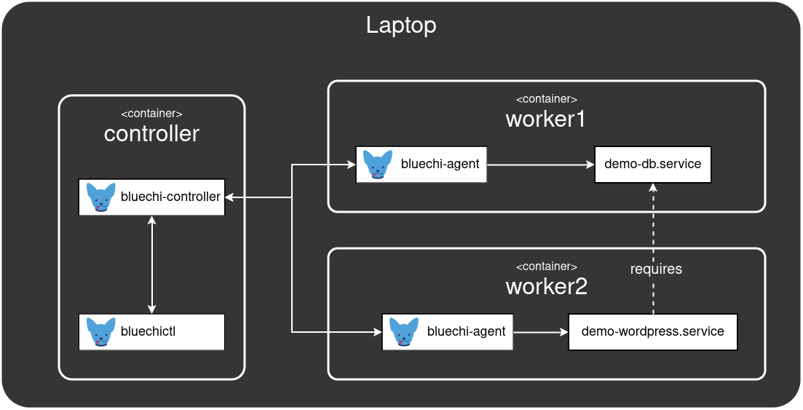
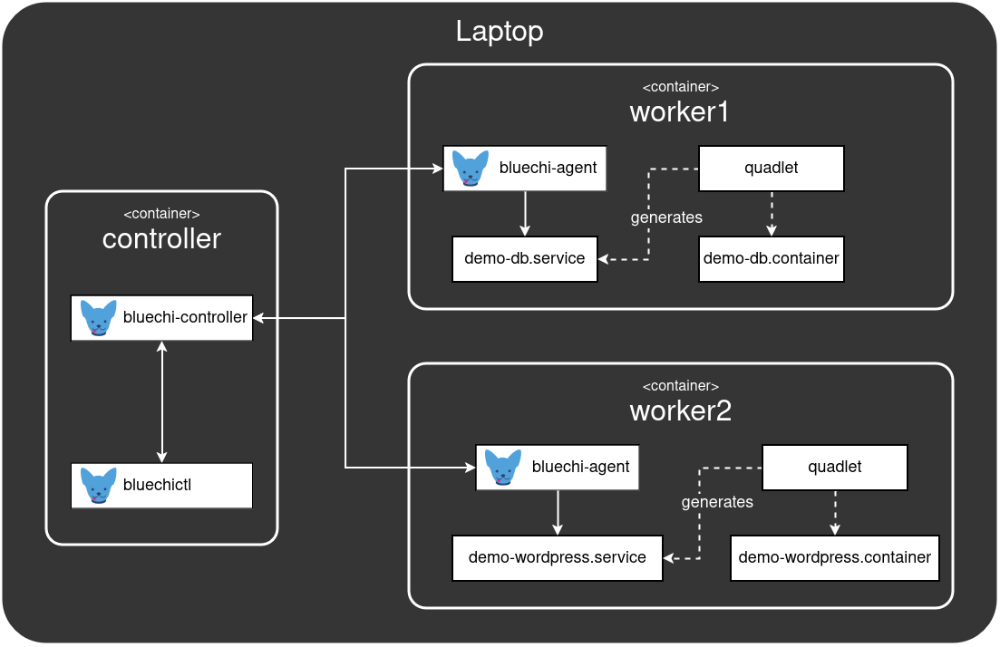

# BlueChi workshop - Deploy containerized applications

In this section we will write our own systemd services - running containerized applications with cross-node dependencies.

## The scenario

Lets assume we want to run Wordpress on `worker2` wrapped in the systemd service `demo-wordpress`. In addition, Wordpress requires a running instance of MariaDB which we start via the `demo-db.service` on the `worker1` node. This is visualized in the diagram below:



On top of that we want to start Wordpress and MariaDB inside a container. 

### Intermezzo: Resolve cross-node dependencies

In order to ensure that MariaDB is started before Wordpress we will use [BlueChi's Proxy Service](https://bluechi.readthedocs.io/en/latest/cross_node_dependencies/proxy_services) feature. It allows us to encode the dependency of Wordpress on MariaDB into the `[Unit]` section of the respective systemd service by using
- any of the [forward properties](https://www.freedesktop.org/software/systemd/man/latest/systemd.unit.html#Mapping%20of%20unit%20properties%20to%20their%20inverses) to specify the requirement dependency, e.g. `Wants=` or `Upholds=`
- any of the ordering properties, e.g. `Before` or `After`

```ini
[Unit]
# ...

# define the strength of the dependency
Wants=bluechi-proxy@<node-name>_<service-name>.service

# define the order of the dependency
After=bluechi-proxy@<node-name>_<service-name>.service
```

In the case of the Wordpress and MariaDB example from above:
```ini
##########################
# demo-wordpress.container

[Unit]
# ...
Wants=bluechi-proxy@worker1_demo-db.service
After=bluechi-proxy@worker1_demo-db.service
```

### Intermezzo: Containerize it!

Quadlet is part of the [Podman](https://github.com/containers/podman) project and enables us to easily write and run containerized applications under systemd. Check out [the documentation](https://docs.podman.io/en/latest/markdown/podman-systemd.unit.5.html) or [this Red Hat Blog](https://www.redhat.com/sysadmin/quadlet-podman) for more details.
It generates systemd services from Quadlet files (with a `.container` file extension) which use system-like syntax - hiding a lot of the complexity when writing systemd units running containerized applications manually. The figure below shows the essential flow:




## Implementing the scenario

### Create directories

First, lets create directories required by Wordpress and MariaDB on the host machine: 

```bash
mkdir -p /tmp/bluechi-workshop/database
mkdir -p /tmp/bluechi-workshop/html
```

### Worker1: Create MariaDB unit

Log into the `worker1` container and create the MariaDB Quadlet file:

```bash
sudo podman exec -it worker1 /bin/bash
vi /etc/containers/systemd/demo-db.container
```

Insert the following configuration:

```bash
[Unit]
Description=DB Container

[Container]
Image=docker.io/mariadb:latest
Network=host
ContainerName=wordpress_db
Environment=MYSQL_ROOT_PASSWORD=pass_1234
Environment=MYSQL_PASSWORD=pass_1234
Environment=MYSQL_DATABASE=wordpress_db
Environment=MYSQL_USER=demouser
Volume=/share/database:/var/lib/mysql:z

[Install]
WantedBy=default.target
```

Now reload systemd daemon and check that the unit was created (do not start it though yet!):

```bash
systemctl daemon-reload
systemctl status demo-db.service
```

Exit the container:

```bash
exit
```

### Worker2: Create Wordpress unit

Log into `worker2` container and create Wordpress Quadlet file:

```bash
sudo podman exec -it worker2 /bin/bash
vi /etc/containers/systemd/demo-wordpress.container
```

Insert the following configuration:

__Note:__
`Wants` and `After` use the BlueChi Proxy Service syntax described in the [previous section](#intermezzo-resolve-cross-node-dependencies).

```bash
[Unit]
Description=Wordpress Container
Wants=bluechi-proxy@worker1_demo-db.service
After=bluechi-proxy@worker1_demo-db.service

[Container]
Image=docker.io/wordpress:6.5.3-php8.3
Network=host
ContainerName=wordpress
Environment=WORDPRESS_DB_HOST=127.0.0.1:3306
Environment=WORDPRESS_DB_NAME=wordpress_db
Environment=WORDPRESS_DB_USER=demouser
Environment=WORDPRESS_DB_PASSWORD=pass_1234
Volume=/share/html:/var/www/html:z

[Install]
WantedBy=default.target
```

Now reload systemd daemon and check that the unit was created:

```bash
systemctl daemon-reload
systemctl status demo-wordpress.service
```

Exit the container:

```bash
exit
```

## Run the application with BlueChi controller

Now that the systemd services on the nodes have been set up, lets log into the `controller` container and review status of the newly created services:

```bash
sudo podman exec -it controller /bin/bash
bluechictl status worker1 demo-db.service
bluechictl status worker2 demo-wordpress.service
```

Now start the `demo-wordpress.service`

```bash
bluechictl start worker2 demo-wordpress.service
```

When checking the status of both services, Wordpress and MariaDB, you should notice that both have been started even though we only started the Wordpress one:

```bash
bluechictl status worker1 demo-db.service
bluechictl status worker2 demo-wordpress.service
```

Final check: Navigate to http://127.0.0.1

---

[< Back](2.BASIC_OPERATIONS.md) | [Next >](4.PROGRAMMING_ASSIGNMENT.md)
